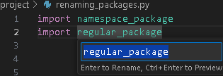

# Why use `__init__.py` files?

A few examples of problems that can occur by using namespace packages instead of regular packages.

**TL;DR: Add an `__init__.py` file in every directory that you want want to import Python code from.**

## Test Coverage

Code in namespace packages are not always found when checking test coverage. Below,
`example_project\namespace_package\foo.py` is not included in the coverage report.

```
$ pytest --cov example_project/
...
Name                                          Stmts   Miss  Cover        
-----------------------------------------------------------------        
example_project\__init__.py                       0      0   100%        
example_project\regular_package\__init__.py       0      0   100%        
example_project\regular_package\bar.py            2      2     0%        
example_project\renaming_packages.py              2      2     0%
example_project\search_modules.py                 4      4     0%
-----------------------------------------------------------------
TOTAL                                             8      8     0%
```

You can specify that coverage should include the namespace package by passing
`--cov example_project/namespace_package`, but this is easy to forget.

## Searching Modules

Namespace packages are not found by the `pkgutils.iter_modules` function.

```
$ python -m example_project.search_modules
regular_package     ispkg=True
renaming_packages   ispkg=False
search_modules      ispkg=False
```

## Renaming Packages

This is more of a convenience than a potential issue, and will depend on your IDE.

For example, Visual Studio Code allows you to rename a regular package by pressing `F2`
over the package name. This will update the name of the directory, and in any files
where the packaged is imported.



However, this is not possible for a namespace package.


## Preventing Accidental Use of Namespace Packages

Both [Ruff](https://docs.astral.sh/ruff/) and [flake8-no-pep420](https://pypi.org/project/flake8-no-pep420/) allow you to check for unintended namespace packages.

```
$ ruff check --select INP
example_project\namespace_package\foo.py:1:1: INP001 File `example_project\namespace_package\foo.py` is
part of an implicit namespace package. Add an `__init__.py`.
Found 1 error.
```

```
$ flake8 example_project/ --select INP
example_project/namespace_package\foo.py:1:1: INP001 File is part of an implicit namespace
package. Add an __init__.py?
```

## Further Reading

- [Python Glossary - Package](https://docs.python.org/3/glossary.html#term-package)
- [Python Reference - The Import System - Namespace Packages](https://docs.python.org/3/reference/import.html#reference-namespace-package)
- [PEP 420 - Implicit Namespace Packages](https://peps.python.org/pep-0420/)
- [Python Packaging User Guide - Packaging Namespace Packages](https://packaging.python.org/en/latest/guides/packaging-namespace-packages/)
- [The Python Tutorial - Modules](https://docs.python.org/3/tutorial/modules.html#packages)
- [Ruff implicit-namespace-package (INP001)](https://docs.astral.sh/ruff/rules/implicit-namespace-package/)
- [flake8-no-pep420](https://pypi.org/project/flake8-no-pep420/)
